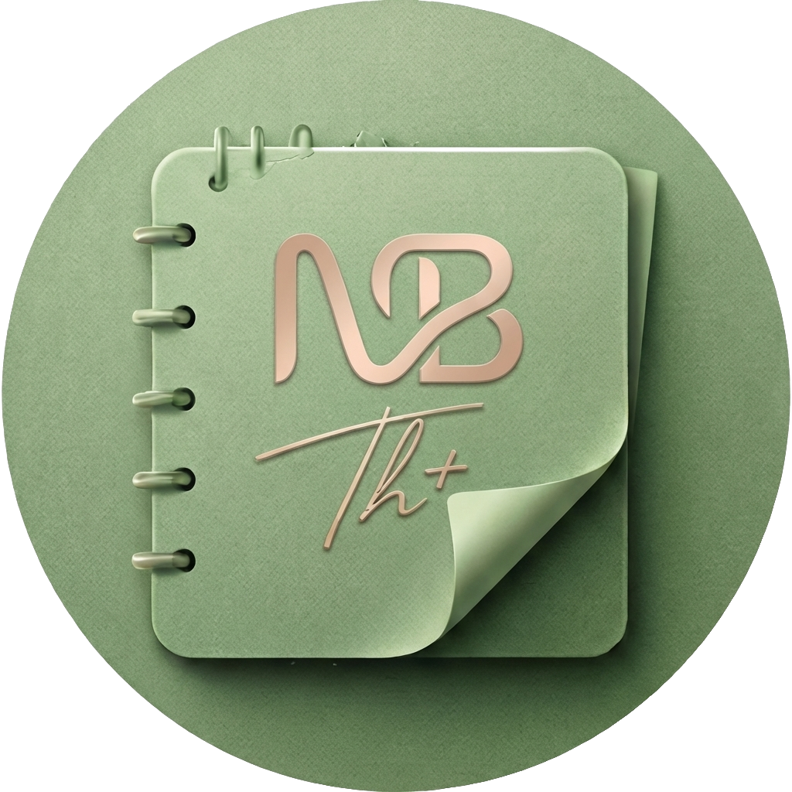

# NoteBook

<p align="center">
  
</p>

<p align="center">
  一款注重隐私的<strong>本地笔记</strong>桌面应用，数据保存在本机，离线可用。
</p>

---

## 简介

**NoteBook** 使用 [Tauri 2](https://v2.tauri.app/) 与 [Vue 3](https://vuejs.org/) 构建，提供文件夹整理、富文本编辑、收藏、废纸篓与 `.tbook` 备份导入导出。无账号、无云端依赖，适合作为个人知识库与日常记录工具。

## 功能亮点

- **本地优先**：SQLite 存储，数据目录由系统应用数据路径管理（见下方「数据存储」）。
- **文件夹与排序**：根级文件夹、笔记拖拽排序、在文件夹间移动。
- **富文本**：基于 Tiptap 的编辑器，适合文章与轻量排版。
- **收藏与筛选**：星标收藏；列表支持按更新时间/标题排序，以及「仅显示有正文字数」等筛选（文件夹内默认保持手动排序）。
- **废纸篓**：删除先入篓，文件夹以单行展示并显示内含笔记数量；**30 天**后自动永久清除；支持恢复。
- **字数统计**：列表展示可统计正文字数（排除图片、音视频、嵌入页、代码块等后的纯文本，不计空白）。
- **备份格式 `.tbook`**：ZIP 包内 JSON，便于迁移；**导出不包含废纸篓**内容。

## 技术栈

| 层级 | 技术 |
|------|------|
| 桌面壳 | Tauri 2 |
| 前端 | Vue 3、TypeScript、Vite |
| 编辑器 | Tiptap 3 |
| 数据 | SQLite（`rusqlite`） |

## 环境要求

- **Node.js** ≥ 20
- **Rust** 稳定版（[`rustup`](https://rustup.rs/)）
- 平台相关依赖见 [Tauri 前置条件](https://v2.tauri.app/start/prerequisites/)

## 开发与构建

```bash
# 安装依赖
npm install

# 仅前端开发（浏览器）
npm run dev

# 桌面端开发（需本机 Rust 环境）
npm run dev:tauri

# 类型检查 + 前端生产构建
npm run build

# 打包桌面应用（macOS 示例）
npm run build:mac
```

### 应用图标

打包用图标由 **`src/assets/notebook-logo.png`** 经 `npm run icons:rebuild` 在本地裁切为正方形、缩放至 1024 后调用 `tauri icon` 生成（中间文件在系统临时目录，不提交仓库）。

**若 macOS 程序坞里图标四角出现「棋盘格」或方形白底**：那是导出 PNG 时把设计软件里表示透明的棋盘格**栅格化进了像素**（假透明），系统会当真颜色画出来。请换成**带 Alpha 通道、四角无杂色**的源图，然后在项目根目录执行：

```bash
npm run icons:rebuild
```

该命令会：用脚本从四角 flood-fill 清除典型浅灰/白假背景 → 裁正方形 → `tauri icon` 生成 `src-tauri/icons/*` → 同步 `public/logo.png` 与 `docs/readme-hero.png`。

仅做透明修正时可：`npm run icons:normalize`（默认处理 `notebook-logo.png`）。需要重新出安装包图标时再执行 `npm run icons:rebuild`。

`docs/readme-hero.png` 与 `notebook-logo.png` 一致，由重建脚本覆盖，供 README 配图。

## 数据存储

- **macOS**：`~/Library/Application Support/com.tal.notebook/`（或对应 `data_local_dir` 下的 `com.tal.notebook/notebook.db`）。
- 卸载应用不会自动删除数据库；备份请使用应用内 **导出 .tbook**。

## 开源许可

本项目以 **MIT License** 开源（见仓库内 `LICENSE` 文件）。第三方依赖各自遵循其许可证。

## 致谢

- [Tauri](https://github.com/tauri-apps/tauri)
- [Vue.js](https://github.com/vuejs/core)
- [Tiptap](https://github.com/ueberdosis/tiptap)

---

<p align="center">
  若本项目对你有帮助，欢迎 Star 与 PR。
</p>
